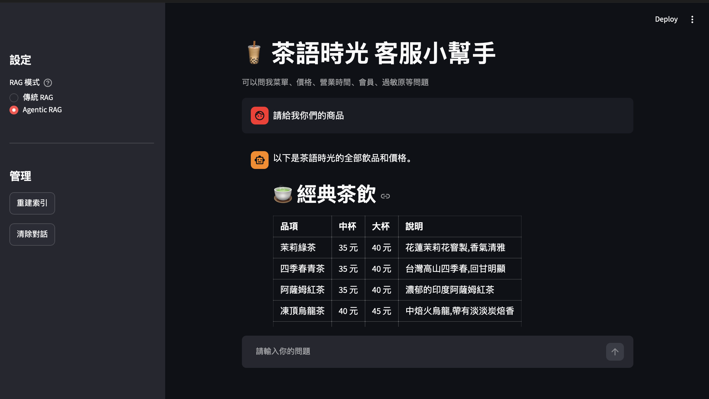

# 🧋 茶語時光 RAG 客服機器人

從零開始用 Python 手寫的 RAG（檢索增強生成）學習專案。以虛構的手搖飲店「茶語時光」為例，做出一個能回答菜單、價格、營業時間、過敏原等問題的客服機器人。

> 知識庫內容為虛構店家資料



## 功能

- **傳統 RAG**：向量檢索 → 組提示詞 → Claude 回答，並附上參考出處
- **Small-to-Big 檢索**：用單句檢索，再帶入整個段落作為上下文
- **Agentic RAG**：讓 Claude 自己決定要用哪些工具、查詢幾次
- **檢索評估**：用測試集計算命中率，比較不同檢索方法
- **Streamlit 網頁介面**：可切換兩種 RAG 模式，並查看參考資料或查詢路徑

## 使用技術

| 用途 | 工具 |
|---|---|
| Embedding | `sentence-transformers`（`BAAI/bge-small-zh-v1.5`） |
| 向量資料庫 | `chromadb` |
| 語言模型 | Claude API（`anthropic`） |
| 網頁介面 | `streamlit` |

## 專案結構

```
tea-shop-rag/
├── data/
│   └── tea_shop_kb.md   # 知識庫
├── docs/
│   └── screenshot.png   # README 用的截圖
├── rag.py               # RAG 核心程式
├── app.py               # Streamlit 網頁介面
├── rag.ipynb            # 學習過程的 notebook
├── requirements.txt
└── .env                 # API 金鑰（不上傳）
```

## 執行
```bash
streamlit run app.py
```
## 學到的事

- RAG 除錯要先判斷是**檢索**還是**生成**出問題，再修改對應的那一層
- 改善知識庫本身，常常比調整程式更有效
- RAG 擅長查找型問題，不擅長需要彙整全部資料的問題，這時 Agentic RAG 表現更好
- 每次修改都用測試集評估，用數字而不是感覺判斷好壞
